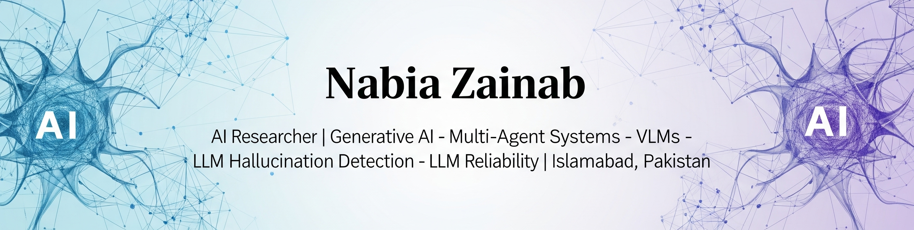

  

  
  
  

---

### 🎯 Professional Objective 
Seeking a challenging position to apply my expertise in **Multi-Agent Systems**, **Multi-Agent Reinforcement Learning**, **Multimodal LLMs**, **Vision-Language Models (VLMs)**, and **Agentic AI systems**. My experience is highlighted by my research on "A Multi-Agent systems for Hallucination Detection," which fuels my aim to contribute to innovative projects at the intersection of advanced AI architectures and practical problem-solving, particularly in areas like multi-agent systems, vision understanding, and intelligent automation.

 

### 🔭 Current Focus & Interests
* 🔬 Currently engaged in research and development involving **Large Language Models (LLMs), Generative AI, and Multi-Agent Systems***.
* 👯 I’m looking to collaborate on research projects related to **Multi-Agent Systems**, **Vision-Language Models (VLMs)**, and **LLM Reliability**.
* 🌱 I’m currently deepening my expertise in advanced **Multi-Agent AI architectures** and **Vision-Language Models**.
* 💡 Passionate about leveraging AI for practical problem-solving and building robust, intelligent systems.

 

### 🔗 Connect & Explore
* 👨‍💻 All my research and development projects are available on GitHub.
* 📫 How to reach me: nabiazainab000@gmail.com
* 📄 Know about my experiences: [**Download my Resume**](Resume.pdf) *
* 💬 Ask me about: **LLM Hallucination**, **Multi-Agent Systems (Agentic AI)**, **RAG**, or **VLMs**.
* ⚡ Fun fact: I embrace challenges and new experiences, viewing every "failure" as an opportunity to learn and innovate.

 

### 🛠️ My Technical Stack

My expertise spans a wide range of AI and development tools.

<table>
  <tr>
    <td align="center" width="180"><strong>Core Languages</strong></td>
    <td align="center" width="180"><strong>AI & Machine Learning</strong></td>
    <td align="center" width="180"><strong>Specialized AI</strong></td>
    <td align="center" width="180"><strong>Tools, Web & DBs</strong></td>
  </tr>
  <tr>
    <td>
      
      
      
      
    </td>
    <td>
      
      
      
      
      
    </td>
    <td>
      
      
      
      
      
    </td>
    <td>
      
      
      
      
      
      
    </td>
  </tr>
</table>

---

### 🚀 Key Research Projects
### 1. A Multi-Agent Framework for Hallucination Detection
* **Description:** Designed a novel multi-agent system where "interrogator" agents query an LLM's response to detect factual inconsistencies and hallucinations *without* external knowledge.
* **Impact:** Developed a coherence scoring mechanism that led to a **40% improvement** in identifying non-factual statements.
* **Tools:** `Python`, `LangChain`, `PyTorch`, `HuggingFace Transformers`.

### 2. VLM-based Medical Image Diagnosis & Analysis
* **Description:** Developed a Vision-Language Model (VLM) pipeline for radiology image diagnosis and automated report generation.
* **Impact:** **Improved diagnostic accuracy by 22%** and reduced report generation time by 40%.
* **Tools:** `SmolVLM`, `Mistral-Small-24B`, `Llama-70B`.

### 3. RAG-based Research Paper Q&A System
* **Description:** Built a specialized chatbot to answer complex questions from a corpus of 200+ academic AI papers.
* **Impact:** Implemented a Retrieval-Augmented Generation (RAG) pipeline that **reduced factual errors by 70%**.
* **Tools:** `LangChain`, `OpenAI API`, `FAISS`, `Streamlit`.

---

### 📊 My GitHub Stats

  
  

